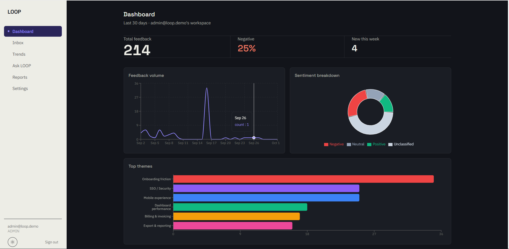
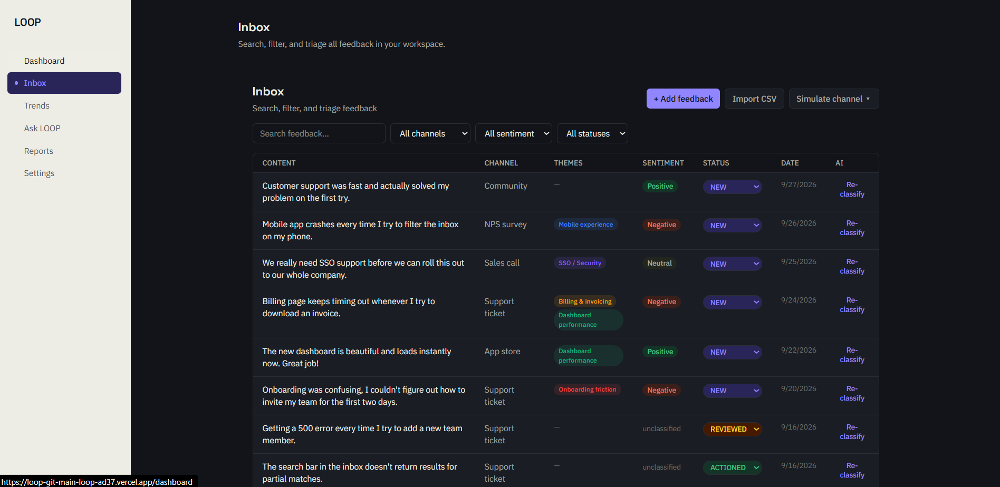
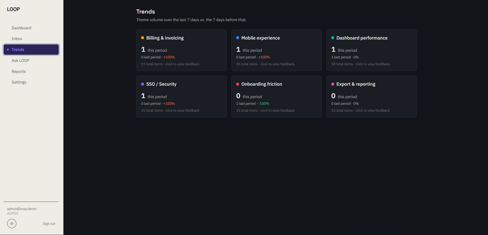
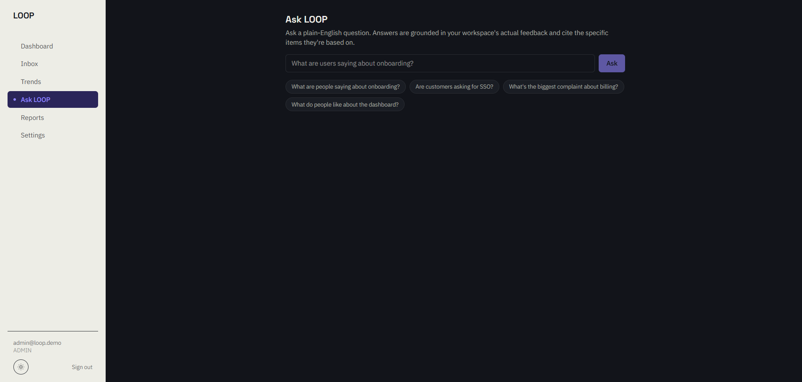
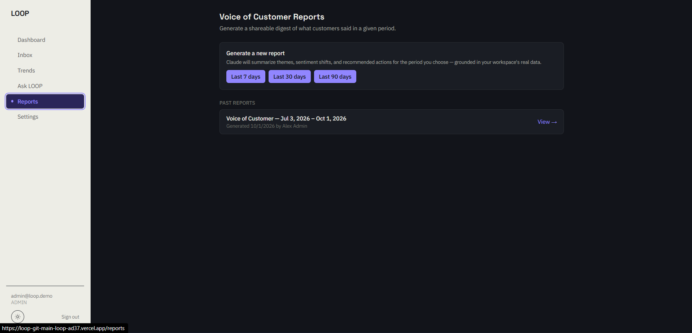

# LOOP — AI Customer-Feedback Intelligence Platform

> Zidio Development Internship — Web Development Track — Project LOOP
> "Close the loop on customer feedback."

LOOP ingests multi-channel customer feedback (support tickets, app-store
reviews, NPS surveys, sales notes, community posts), uses AI to
classify and cluster it, surfaces trending themes, answers plain-English
questions grounded in the actual feedback, and generates a shareable
Voice-of-Customer report — all inside a secure, multi-tenant workspace
with role-based access control.

**Live demo:** https://loop-qy61y2tyw-loop-ad37.vercel.app/
**Demo video:** _add your video link here_

## Status

All four milestones are complete:

- ✅ **M1 — Foundation:** auth, multi-tenant workspaces, RBAC, tenant isolation
- ✅ **M2 — Core app:** feedback ingestion (manual / CSV / simulated channel), inbox with search & filters, analytics dashboard
- ✅ **M3 — AI features:** auto-classification, theme clustering & trends, Ask LOOP (grounded Q&A)
- ✅ **M4 — Production:** Voice-of-Customer reports, member management, hardening, dark mode

## Features

### Core application
- **Multi-tenant workspaces** with three roles — Admin, Analyst, Viewer — enforced server-side on every API route, not just hidden in the UI
- **Feedback ingestion** — single-entry form, CSV bulk upload (with a success/failure report), and a "Simulate channel" button that mimics a real integration
- **Inbox** — server-side pagination, full-text search, filters (channel / sentiment / status / theme / date range), and a status workflow (New → Reviewed → Actioned)
- **Analytics dashboard** — live charts for volume over time, sentiment breakdown, and top themes, plus headline stats

### AI (Google Gemini)
- **Auto-classification (AI1)** — every new feedback item is sent to Gemini on ingest and comes back tagged with sentiment, a sentiment score, 1–3 themes, and a feature area, returned as validated structured JSON. A manual "Re-classify" action is available per item.
- **Theme clustering & trends (AI2)** — feedback is grouped into themes automatically (reusing existing themes where they fit), and the Trends page flags themes spiking 30%+ week-over-week.
- **Ask LOOP (AI3)** — a grounded Q&A box. Retrieval (keyword-relevance ranking over the workspace's feedback) runs first, then Gemini answers **using only the retrieved items** and cites which ones it used — it's explicitly instructed to say so rather than invent an answer if the data doesn't cover the question.
- **Voice-of-Customer report (AI4)** — pick a period, and Gemini writes a narrative summary and recommended actions around numbers that are pre-computed in code (not by the model), so the report can't hallucinate statistics. Reports are saved, viewable later, and exportable as a PDF via the browser's print dialog.

> **Scope note — AI provider:** the brief specifies the Anthropic Claude
> API. This project uses the **Google Gemini API** instead
> (`gemini-3.1-flash-lite`), switched with my mentor's approval after an
> Anthropic account billing/credits blocker. All four AI features, the
> structured-JSON classification approach, and the retrieval-then-answer
> grounding pattern are implemented exactly as the brief specifies in
> Section 09 — only the model provider differs. The integration lives
> entirely in `lib/ai-client.ts`, `lib/ai.ts`, and `lib/reports.ts`, so
> swapping providers again would only mean changing those three files.

### Auth & security
- **Email verification via OTP** on signup — a 6-digit code with a 10-minute expiry and a 5-attempt limit before the account (Workspace + Admin user) is actually created.

  > **Scope note — OTP delivery:** real email/SMS delivery is explicitly
  > out of scope for this project (see the brief, Section 4.2). The OTP
  > is generated, stored, and verified exactly as a production flow
  > would — only the delivery channel is swapped out: the code is
  > returned directly in the API response and shown in a
  > clearly-labeled "dev preview" banner on the signup screen instead of
  > being emailed. Wiring in a real email provider (e.g. Resend) would
  > mean removing `devCode` from
  > `app/api/auth/signup/request-otp/route.ts` and calling the provider
  > there instead.

- **Password requirements** — at least 8 characters, one uppercase, one lowercase, one number, one special character. Enforced server-side (Zod) and shown live as a checklist while typing.
- **Tenant isolation** — every database query that touches feedback, themes, reports, or users is filtered by the authenticated session's `workspaceId`, never by a client-supplied value. See `lib/guard.ts`.

### Design
- Custom design system ("Signal & Ink") — not a default Tailwind/shadcn look. Space Grotesk for headings/UI, IBM Plex Sans for body and data, a single deep violet-blue accent, and hairline dividers instead of boxed shadow-cards.
- **Dark mode** — toggle in the sidebar/header, respects system preference by default, persisted per-browser via `localStorage`.
- **Responsive** — sidebar collapses to a mobile slide-over menu; auth screens stack to a single column on small viewports.

## Tech stack

| Layer | Technology |
|---|---|
| Framework | Next.js 14 (App Router) + TypeScript |
| Styling | Tailwind CSS v4, custom design tokens |
| Fonts | Space Grotesk (display), IBM Plex Sans (body) |
| Database | PostgreSQL (Neon / Supabase free tier) |
| ORM | Prisma |
| Auth | NextAuth (Auth.js) v5, credentials provider + OTP email verification |
| AI | Google Gemini API (`gemini-3.1-flash-lite`) — see scope note above |
| Validation | Zod |
| Charts | Recharts |
| Deployment | Vercel |

## Local setup

### 1. Prerequisites
- Node.js 18+ and npm
- A free PostgreSQL database — [Neon](https://neon.tech) or [Supabase](https://supabase.com)
- A free Google Gemini API key — [Google AI Studio](https://aistudio.google.com/apikey)

### 2. Install
```bash
npm install
```

### 3. Environment variables
Copy `.env.example` to `.env` and fill in:

```bash
cp .env.example .env
```

| Variable | Description |
|---|---|
| `DATABASE_URL` | PostgreSQL connection string from Neon/Supabase |
| `NEXTAUTH_SECRET` | Random secret — generate with `openssl rand -base64 32` |
| `NEXTAUTH_URL` | `http://localhost:3000` locally, your production URL when deployed |
| `GEMINI_API_KEY` | Your Google Gemini API key (server-side only, never exposed to the browser) |

> **Never commit real keys.** `.env` is already in `.gitignore`. If a
> real key is ever accidentally pasted into a tracked file (like this
> README), GitHub's push protection will block the push — remove the
> key, amend or reset the commit, and rotate the key as a precaution.

### 4. Database
```bash
npx prisma generate
npx prisma migrate dev --name init
npm run seed
```

`npm run seed` creates one demo workspace ("Acme Corp (Demo)"), three
users — one per role — and 130+ realistic feedback items across 6
themes and 5 channels.

**Demo login credentials** (seeded workspace, pre-verified — no OTP needed to log in):

| Role | Email | Password |
|---|---|---|
| Admin | `admin@loop.demo` | `Demo1234!` |
| Analyst | `analyst@loop.demo` | `Demo1234!` |
| Viewer | `viewer@loop.demo` | `Demo1234!` |

> Signing up a *new* workspace (rather than using the seeded one) goes
> through the OTP flow described above.

### 5. Run
```bash
npm run dev
# http://localhost:3000
```

## Architecture

Three-tier: browser → Next.js Route Handlers (API layer) → PostgreSQL,
with Gemini called server-side only.

```
Client (React Server/Client Components)
        │
        ▼
API layer — app/api/**  (auth guard → role guard → workspaceId scoping → Zod validation)
        │
        ├──▶ Prisma ──▶ PostgreSQL   (every tenant table has workspaceId)
        └──▶ Gemini API (server-side only, never called from the browser)
```

**Non-negotiable rule:** every query in `/lib` and `/app/api` that touches
`feedback`, `themes`, `reports`, or `users` is filtered by
`session.workspaceId` from the authenticated session — never from a
client-supplied value. See `lib/guard.ts`.

**AI3 retrieval note:** Ask LOOP's retrieval step (`lib/search.ts`) uses
keyword-overlap scoring rather than true vector embeddings, to avoid
requiring a second external API/account for this project's scope. To
upgrade to semantic search: populate the existing `Embedding` model on
ingest via a hosted embeddings provider, then swap
`retrieveRelevantFeedback`'s body for a pgvector cosine-similarity query
— the rest of the Ask LOOP pipeline (grounded answer + citations)
doesn't need to change.

**AI reliability note:** `lib/ai-client.ts` retries automatically on
transient Gemini errors (503 "high demand" and 429 rate-limit
responses), honoring the exact wait time Gemini's API returns rather
than guessing. `gemini-3.1-flash-lite` was chosen over the newest
flagship model specifically because its free-tier rate limit is high
enough for this project's batch operations (CSV import, simulate
channel), which can trigger several classification calls in quick
succession.

## Project structure

```
loop/
  app/
    (auth)/login, signup            # split-panel auth, OTP verification
    (app)/dashboard, inbox, trends, ask, reports, settings
    api/
      auth/[...nextauth]            # NextAuth handlers
      auth/signup/request-otp       # step 1: validate + send OTP
      auth/signup/verify-otp        # step 2: verify + create Workspace/User
      feedback/                     # CRUD, CSV import, simulate-channel, re-classify
      themes/                       # theme list
      insights/summary              # dashboard chart data
      insights/trends               # theme trends + spike detection
      insights/ask                  # Ask LOOP
      reports/                      # VoC report generate + list + view
      workspace/members             # member management (Admin)
  components/
    charts/                         # volume, sentiment, top-themes
    app-shell.tsx                   # responsive sidebar shell
    auth-panel.tsx                  # shared auth-screen visual panel
    theme-toggle.tsx                # dark mode toggle
    password-strength.tsx           # live password checklist
    inbox-client.tsx, reports-client.tsx, members-client.tsx
  lib/
    ai.ts, ai-client.ts             # Gemini calls: classify, answer (+ retry/backoff)
    reports.ts                      # VoC report generation
    search.ts                       # Ask LOOP retrieval
    classification.ts               # persists AI classification results
    otp.ts                          # OTP generation/verification
    auth.ts, guard.ts, db.ts        # session, RBAC, Prisma client
    validation/schemas.ts           # Zod schemas
  prisma/
    schema.prisma
    seed.ts
```

## Roles

| Role | Can do |
|---|---|
| Admin | Everything Analyst can, plus manage members & roles |
| Analyst | Ingest feedback, manage status, view everything |
| Viewer | Read-only |

Role checks are enforced **server-side** in every API route (`lib/guard.ts`
→ `requireRole`) — not just hidden in the UI. Forbidden actions return
`403`.

## Screenshots







## Known trade-offs (documented, not accidental)

- **AI provider is Google Gemini, not Anthropic Claude** — see the scope note under "AI" above.
- **Ask LOOP retrieval is lexical, not vector-based** — see the architecture note above.
- **OTP delivery is simulated** (shown on-screen, not emailed) — real email/SMS is out of scope per the brief.
- **AI calls are awaited inline** rather than queued in a background job — acceptable at this project's data volumes; a production system at scale would move classification to a job queue.
